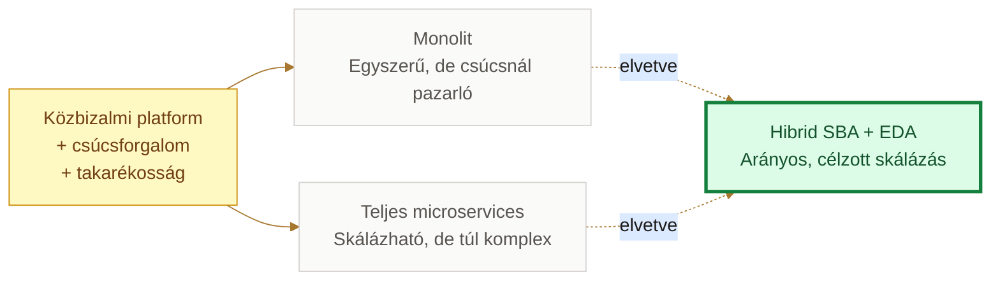
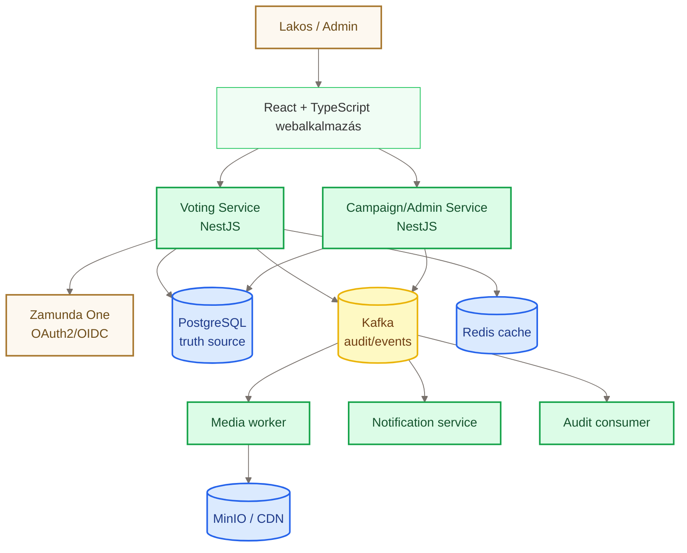
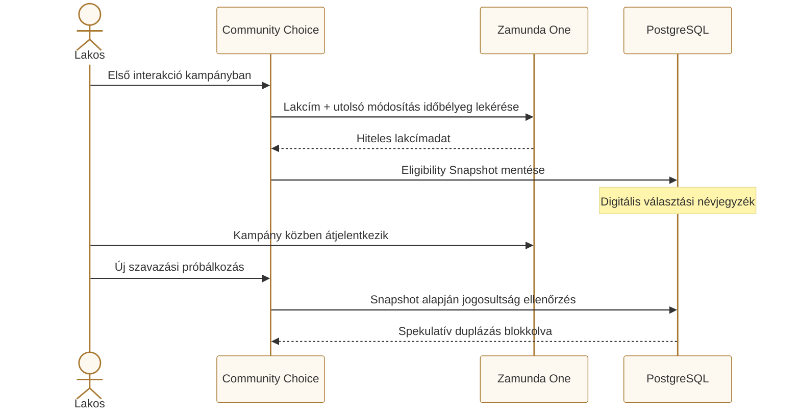
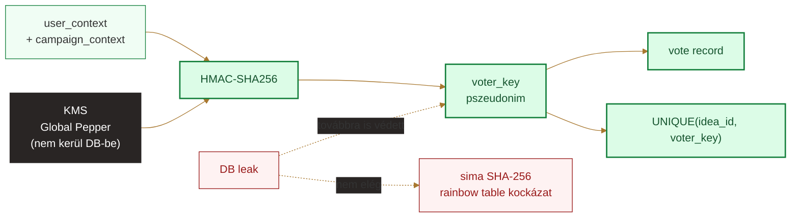
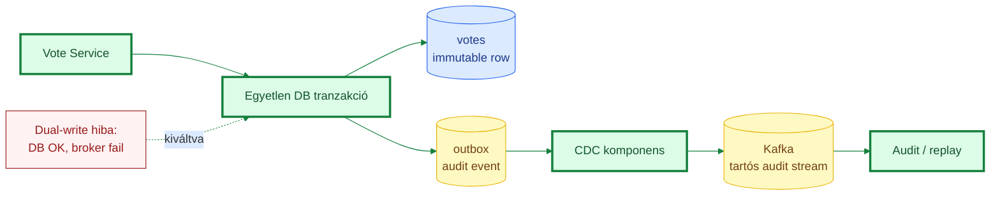

# Community Choice védés — Mermaid diagramforrások

Ezek a diagramok a `community-choice-vedes.html` prezentáció vizuális ábráinak Mermaid-verziói. A színek a `design/brand-styleguide.html` palettájához igazodnak.

## 1. Architekturális döntési tér

## 2. C4 / konténer nézet

## 3. Jogosultsági pillanatkép

## 4. Paranoiás pszeudonimizáció KMS pepperrel

## 5. Transactional Outbox + CDC

