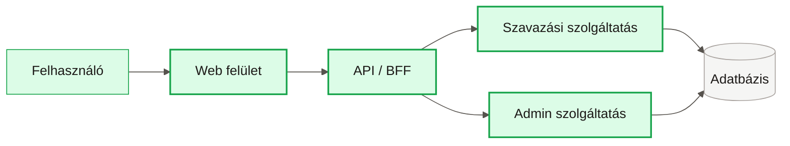
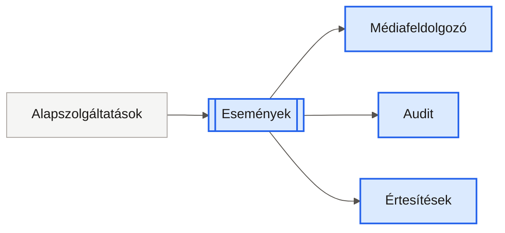
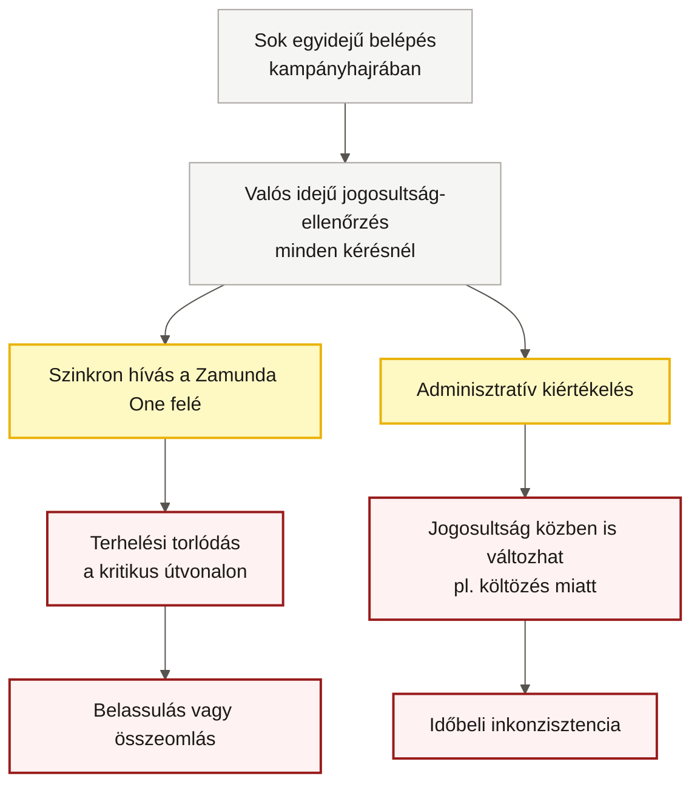
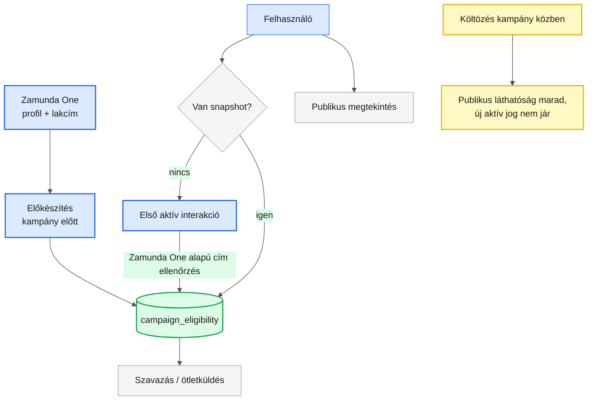

# Prezentációs diagramok

## 1. Szinkron makroszolgáltatások

## 2. Eseményvezérelt háttérfolyamatok

## 3. Valós idejű jogosultság-ellenőrzés problémája

## 4. Megváltoztathatatlan jogosultsági pillanatkép

